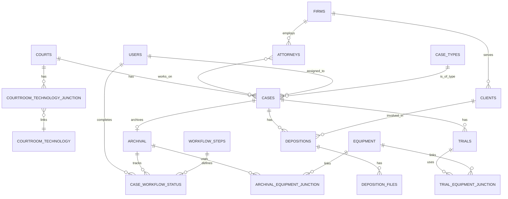

# Data Schema Plan for Trial Organizer (SQLite3)

This document outlines the refined data schema for the Trial Organizer, designed for an SQLite3 database. It incorporates the initial requirements and suggested improvements for normalization, scalability, and data integrity.

## 1. Courts Table

This table will store information about various courts.

**Primary Key:** `court_id` (TEXT, e.g., 'C-001')

**Columns:**
*   `court_id` (TEXT, PRIMARY KEY)
*   `court_name` (TEXT, NOT NULL)
*   `address` (TEXT)
*   `city` (TEXT)
*   `state` (TEXT)
*   `zip_code` (TEXT)
*   `general_phone` (TEXT)
*   `tech_support_phone` (TEXT)
*   `court_website_link` (TEXT)
*   `tech_support_website_link` (TEXT)
*   `parking_info_link` (TEXT)
*   `google_maps_link` (TEXT)
*   `distance_from_office_mi` (REAL)
*   `projector_screen` (BOOLEAN, DEFAULT FALSE)
*   `doc_camera` (BOOLEAN, DEFAULT FALSE)
*   *(...other courtroom technology boolean columns as needed)*

**Relationships:**
*   One-to-many with `Cases` table (via `court_id`)
*   One-to-many with `Courtroom_Technology_Junction` table (via `court_id`)

## 2. Courtroom_Technology Table

This table will list available courtroom technologies.

**Primary Key:** `tech_id` (TEXT, e.g., 'TECH-001')

**Columns:**
*   `tech_id` (TEXT, PRIMARY KEY)
*   `tech_name` (TEXT, NOT NULL)
*   `description` (TEXT)

**Relationships:**
*   Many-to-many with `Courts` table (via `Courtroom_Technology_Junction`)

## 3. Courtroom_Technology_Junction Table

This junction table links courts to the technologies they possess.

**Primary Key:** Composite (`court_id`, `tech_id`)

**Columns:**
*   `court_id` (TEXT, FOREIGN KEY REFERENCES `Courts(court_id)`)
*   `tech_id` (TEXT, FOREIGN KEY REFERENCES `Courtroom_Technology(tech_id)`)
*   `quantity` (INTEGER, DEFAULT 1)
*   `notes` (TEXT)

## 4. Firms Table

This table will store information about law firms.

**Primary Key:** `firm_id` (TEXT, e.g., 'FIRM-001')

**Columns:**
*   `firm_id` (TEXT, PRIMARY KEY)
*   `firm_name` (TEXT, NOT NULL)
*   `address` (TEXT)
*   `phone` (TEXT)
*   `website` (TEXT)

**Relationships:**
*   One-to-many with `Attorneys` table (via `firm_id`)
*   One-to-many with `Clients` table (via `firm_id`)

## 5. Attorneys Table

This table will store information about attorneys.

**Primary Key:** `attorney_id` (TEXT, e.g., 'ATT-001')

**Columns:**
*   `attorney_id` (TEXT, PRIMARY KEY)
*   `attorney_name` (TEXT, NOT NULL)
*   `firm_id` (TEXT, FOREIGN KEY REFERENCES `Firms(firm_id)`)
*   `contact_info` (TEXT)

**Relationships:**
*   Many-to-many with `Cases` table (via `Case_Attorneys_Junction`)

## 6. Users Table (for Tech Assigned)

This table will store information about internal users/employees.

**Primary Key:** `user_id` (TEXT, e.g., 'USR-001')

**Columns:**
*   `user_id` (TEXT, PRIMARY KEY)
*   `username` (TEXT, NOT NULL, UNIQUE)
*   `full_name` (TEXT)
*   `role` (TEXT)
*   `contact_info` (TEXT)

**Relationships:**
*   One-to-many with `Cases` table (via `tech_assigned_user_id`)
*   One-to-many with `Case_Workflow_Status` table (via `completed_by_user_id`)

## 7. Case_Types Table

This lookup table will store predefined case types.

**Primary Key:** `case_type_id` (TEXT, e.g., 'CT-001')

**Columns:**
*   `case_type_id` (TEXT, PRIMARY KEY)
*   `type_name` (TEXT, NOT NULL, UNIQUE)
*   `description` (TEXT)

**Relationships:**
*   One-to-many with `Cases` table (via `case_type_id`)

## 8. Cases Table

This is the main project tracker.

**Primary Key:** `case_id` (TEXT, e.g., 'A-1234')

**Columns:**
*   `case_id` (TEXT, PRIMARY KEY)
*   `case_name` (TEXT, NOT NULL)
*   `case_type_id` (TEXT, FOREIGN KEY REFERENCES `Case_Types(case_type_id)`)
*   `start_date` (DATETIME)
*   `end_date` (DATETIME)
*   `firm_id` (TEXT, FOREIGN KEY REFERENCES `Firms(firm_id)`)
*   `court_id` (TEXT, FOREIGN KEY REFERENCES `Courts(court_id)`)
*   `tech_assigned_user_id` (TEXT, FOREIGN KEY REFERENCES `Users(user_id)`)
*   `last_update_timestamp` (DATETIME, DEFAULT CURRENT_TIMESTAMP)
*   *(...other relevant case fields)*

**Relationships:**
*   One-to-one with `Archival` table (via `case_id`)
*   One-to-many with `Depositions` table (via `case_id`)
*   One-to-many with `Trials` table (via `case_id`)
*   Many-to-many with `Attorneys` table (via `Case_Attorneys_Junction`)

## 9. Case_Attorneys_Junction Table

This junction table links cases to attorneys.

**Primary Key:** Composite (`case_id`, `attorney_id`)

**Columns:**
*   `case_id` (TEXT, FOREIGN KEY REFERENCES `Cases(case_id)`)
*   `attorney_id` (TEXT, FOREIGN KEY REFERENCES `Attorneys(attorney_id)`)

## 10. Archival Table

This table stores archival and workflow tracking information for concluded cases.

**Primary Key:** `archival_id` (TEXT, e.g., 'ARCH-1')

**Columns:**
*   `archival_id` (TEXT, PRIMARY KEY)
*   `case_id` (TEXT, UNIQUE, FOREIGN KEY REFERENCES `Cases(case_id)`)
*   `date_case_concluded` (DATETIME)
*   `outcome` (TEXT)
*   `concluding_attorney_id` (TEXT, FOREIGN KEY REFERENCES `Attorneys(attorney_id)`)

**Relationships:**
*   One-to-one with `Cases` table (via `case_id`)
*   One-to-many with `Case_Workflow_Status` table (via `archival_id`)
*   One-to-many with `Archival_Equipment_Junction` table (via `archival_id`)

## 11. Workflow_Steps Table

This lookup table defines the steps in the archival workflow.

**Primary Key:** `step_id` (TEXT, e.g., 'STEP-001')

**Columns:**
*   `step_id` (TEXT, PRIMARY KEY)
*   `step_name` (TEXT, NOT NULL, UNIQUE)
*   `description` (TEXT)
*   `step_order` (INTEGER)

**Relationships:**
*   Many-to-many with `Archival` table (via `Case_Workflow_Status`)

## 12. Case_Workflow_Status Table

This junction table tracks the completion status of workflow steps for each archived case.

**Primary Key:** Composite (`archival_id`, `step_id`)

**Columns:**
*   `archival_id` (TEXT, FOREIGN KEY REFERENCES `Archival(archival_id)`)
*   `step_id` (TEXT, FOREIGN KEY REFERENCES `Workflow_Steps(step_id)`)
*   `is_completed` (BOOLEAN, DEFAULT FALSE)
*   `completion_date` (DATETIME)
*   `completed_by_user_id` (TEXT, FOREIGN KEY REFERENCES `Users(user_id)`)

## 13. Trials Table

This table tracks individual trials within a case.

**Primary Key:** `trial_id` (TEXT, e.g., 'TRL-001')

**Columns:**
*   `trial_id` (TEXT, PRIMARY KEY)
*   `case_id` (TEXT, FOREIGN KEY REFERENCES `Cases(case_id)`)
*   `trial_name_description` (TEXT)
*   `start_date` (DATETIME)
*   `end_date` (DATETIME)
*   `court_id` (TEXT, FOREIGN KEY REFERENCES `Courts(court_id)`)
*   `judge` (TEXT)
*   `outcome` (TEXT)

**Relationships:**
*   Many-to-many with `Equipment` table (via `Trial_Equipment_Junction`)

## 14. Equipment Table

This table lists all available equipment.

**Primary Key:** `equipment_id` (TEXT, e.g., 'EQ-001')

**Columns:**
*   `equipment_id` (TEXT, PRIMARY KEY)
*   `equipment_name` (TEXT, NOT NULL)
*   `description` (TEXT)
*   `type` (TEXT)

**Relationships:**
*   Many-to-many with `Archival` table (via `Archival_Equipment_Junction`)
*   Many-to-many with `Trials` table (via `Trial_Equipment_Junction`)

## 15. Archival_Equipment_Junction Table

This junction table tracks equipment used for archived cases.

**Primary Key:** Composite (`archival_id`, `equipment_id`)

**Columns:**
*   `archival_id` (TEXT, FOREIGN KEY REFERENCES `Archival(archival_id)`)
*   `equipment_id` (TEXT, FOREIGN KEY REFERENCES `Equipment(equipment_id)`)
*   `quantity_used` (INTEGER)
*   `notes` (TEXT)

## 16. Trial_Equipment_Junction Table

This junction table tracks equipment used for trials.

**Primary Key:** Composite (`trial_id`, `equipment_id`)

**Columns:**
*   `trial_id` (TEXT, FOREIGN KEY REFERENCES `Trials(trial_id)`)
*   `equipment_id` (TEXT, FOREIGN KEY REFERENCES `Equipment(equipment_id)`)
*   `quantity_used` (INTEGER)
*   `notes` (TEXT)

## 17. Clients Table

This table will store client information.

**Primary Key:** `client_id` (TEXT, e.g., 'CLT-001')

**Columns:**
*   `client_id` (TEXT, PRIMARY KEY)
*   `client_name` (TEXT, NOT NULL)
*   `contact_person` (TEXT)
*   `contact_info` (TEXT)
*   `firm_id` (TEXT, FOREIGN KEY REFERENCES `Firms(firm_id)`)

**Relationships:**
*   One-to-many with `Depositions` table (via `client_id`)

## 18. Depositions Table

This table tracks deposition details.

**Primary Key:** `deposition_id` (TEXT, e.g., 'D-4321')

**Columns:**
*   `deposition_id` (TEXT, PRIMARY KEY)
*   `client_id` (TEXT, FOREIGN KEY REFERENCES `Clients(client_id)`)
*   `case_id` (TEXT, FOREIGN KEY REFERENCES `Cases(case_id)`)
*   `deponent_name` (TEXT)
*   `depo_date` (DATETIME)
*   `edited_runtime` (TEXT)
*   `notes` (TEXT)

**Relationships:**
*   One-to-many with `Deposition_Files` table (via `deposition_id`)

## 19. Deposition_Files Table

This table stores links to deposition-related files.

**Primary Key:** `file_id` (TEXT, e.g., 'FILE-001')

**Columns:**
*   `file_id` (TEXT, PRIMARY KEY)
*   `deposition_id` (TEXT, FOREIGN KEY REFERENCES `Depositions(deposition_id)`)
*   `file_type` (TEXT, e.g., 'Video', 'Transcript', 'Designations')
*   `file_url` (TEXT)
*   `notes` (TEXT)

## Schema Diagram (Conceptual)

This refined schema provides a more robust and flexible foundation for your CRM, leveraging the benefits of a relational database like SQLite3.